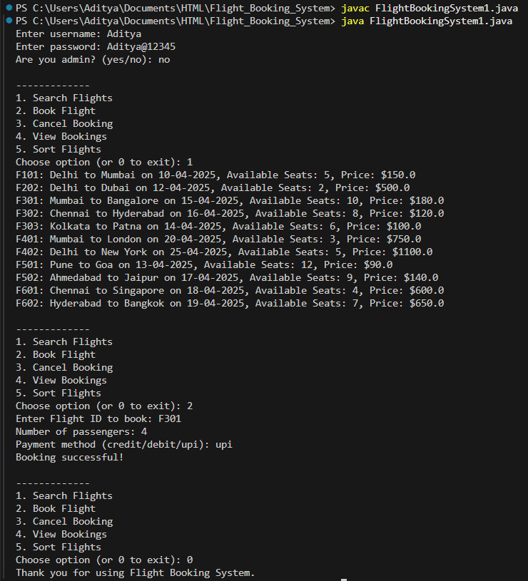
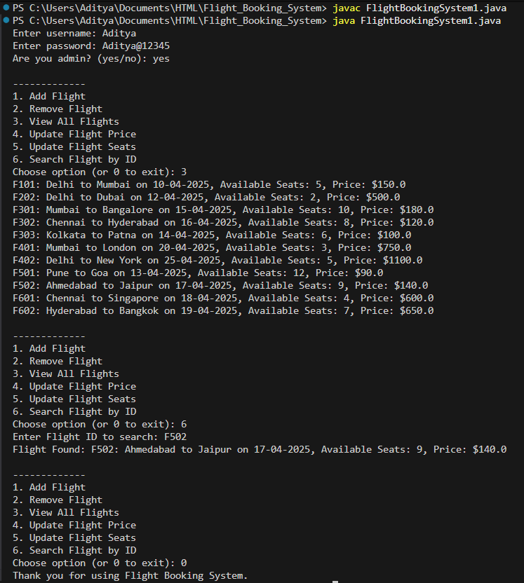

# ✈️ Flight Booking System

## 📌 Java Mini Project

This project is a **Java-based Flight Booking System** developed as a **mini group project** using **core Object-Oriented Programming (OOP) concepts**.  
It simulates the basic operations of an airline reservation system through a **console-based application**.

The system supports **Admin and User roles**, allowing admins to manage flights and users to search, book, and manage **domestic and international flight bookings**, including payment processing.  
The project emphasizes **clean code structure, modular design, and OOP principles** such as inheritance, encapsulation, and polymorphism.

---

## 🚀 Features
- Admin and User login system  
- Domestic and International flight booking  
- Flight management system (Add, Remove, Update, Search flights)  
- Booking management (Book, Cancel, View bookings)  
- Payment handling (Credit / Debit / UPI)  
- Console-based interaction  
- Object-Oriented design using Java  

---

## 🛠️ Technologies Used
- Java  
- Object-Oriented Programming (OOP)  
- Console / Terminal-based execution  

---

## ▶️ How to Run
1. Download or clone the repository  
2. Open the project in any Java-supported IDE (Eclipse / IntelliJ / VS Code)  
3. Compile the Java file:
   ```bash
   javac FlightBookingSystem1.java


## 📷 Screenshots

Below are some screenshots demonstrating the working of the Flight Booking System.

### 🔹 Main Menu


### 🔹 User Flight Booking


### 🔹 Admin Flight Management


---

🎯 Project Purpose

  This project is developed for educational and learning purposes only.
  It does not include database integration, graphical user interfaces, or real-time payment processing.

---

🔮 Future Improvements

  Add database connectivity (MySQL / JDBC)

  Implement a graphical user interface (GUI) using JavaFX or Swing

  Improve input validation and exception handling

  Add real-time flight data simulation

  ---

👨‍🎓 Academic Use

  This project is developed as part of a Java Mini / Group Project.
